# Intermodal Triplet Learning for Crossmodal Retrieval

A PyTorch implementation for an intermodal triplet network to learn the joint embedding space of both text and
images. An application is crossmodal retrieval where given an image, we obtain the most relevant words and
vice versa.

This particular implementation was trained on the NUSWIDE dataset that contains 81 groundtruth tags for each
image along with noisy user-made tags. 

# Image to Text Example:

For each given image (on the bottom of each list), the 10 nearest words are retrieved using FAISS

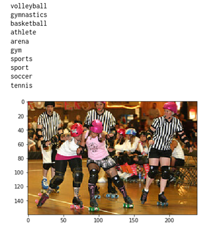 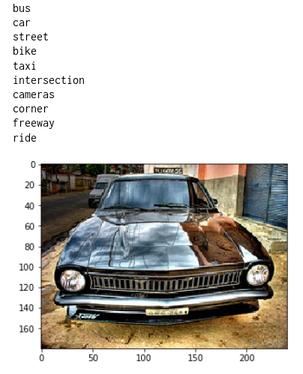 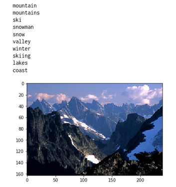
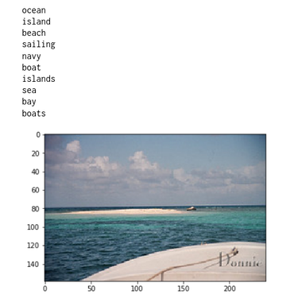  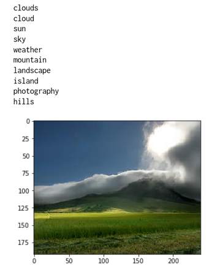

# Text to Image Example:

For each text query, the nearest 3 images are retrieved using FAISS

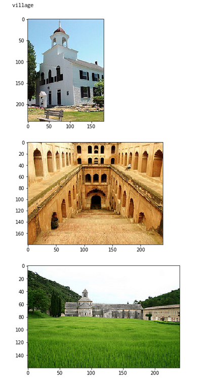 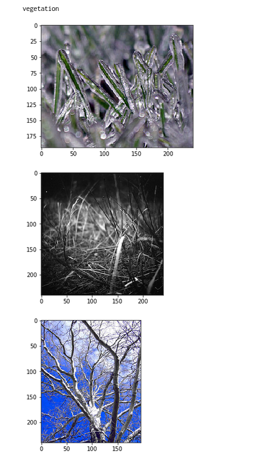 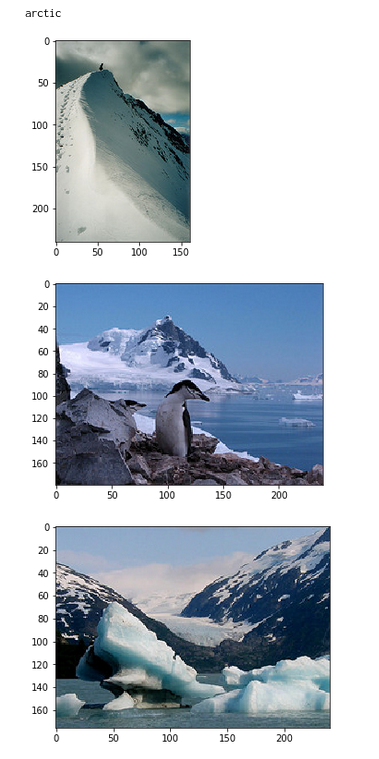
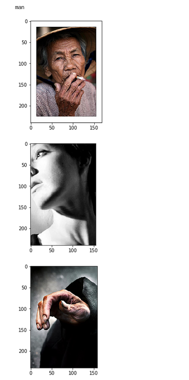 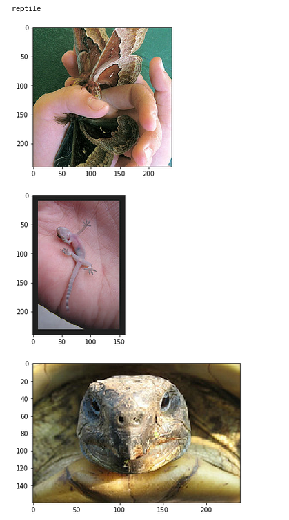 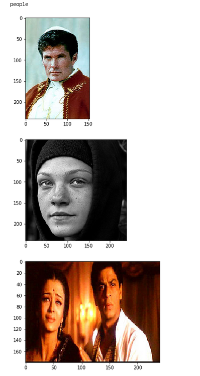
